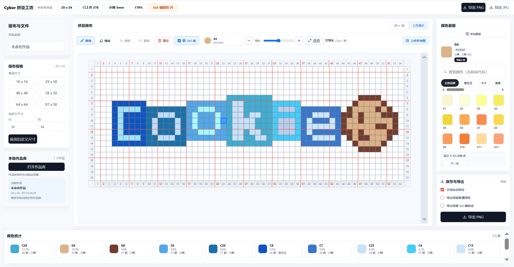

# Cyber 拼豆工坊

Cyber 拼豆工坊是一款面向拼豆图案设计的浏览器端编辑工具，提供画布绘制、色卡选择、本地作品管理、颜色统计和图片导出等能力。用户可以在网格画布中完成像素级拼豆设计，并根据实际拼豆颜色和数量进行制作准备。



## 产品特点

- 专业拼豆画布：支持常用画布规格与自定义行列尺寸，适配不同尺寸的拼豆作品。
- 精准网格绘制：提供画笔、橡皮、撤销、重做、清空和 5x5 辅助线，方便逐格设计。
- 多品牌色卡：内置拼豆色卡，可按品牌筛选、搜索颜色，并快速切换当前颜色。
- 实时颜色统计：自动统计已使用颜色、占比与颗数，辅助备料和制作。
- 本地作品库：作品草稿保存在当前浏览器，支持继续编辑和管理本地作品。
- 图片导出：支持导出 PNG 和 JPG，便于保存、分享或打印参考。

## 界面组成

### 画布与文件

左侧面板用于管理作品名称、画布规格和本地作品库。用户可以选择常用尺寸，也可以输入自定义行列，快速建立适合当前作品的拼豆画布。

### 拼豆画布

中间区域是主要绘制区，包含绘图工具栏、缩放控制、辅助线开关和参考图上传入口。画布支持滚动与缩放，便于在大尺寸作品中进行细节编辑。

### 颜色面板

右侧面板用于选择拼豆颜色。当前颜色会显示色号、颜色值和所属品牌，常用色卡以网格形式展示，便于快速取色。

### 保存与导出

保存与导出面板支持本地自动保存，并可按需要导出带网格或辅助线的图片文件。

### 颜色统计

底部颜色统计区域展示当前作品中每种颜色的使用情况，包括色号、占比、颗数和品牌信息，方便用户核对材料用量。

## 技术信息

- React
- TypeScript
- Vite
- Zustand
- HTML Canvas
- localStorage

## 本地运行

安装依赖：

```bash
npm install
```

启动开发服务：

```bash
npm run dev
```

构建生产版本：

```bash
npm run build
```

预览生产构建：

```bash
npm run preview
```
